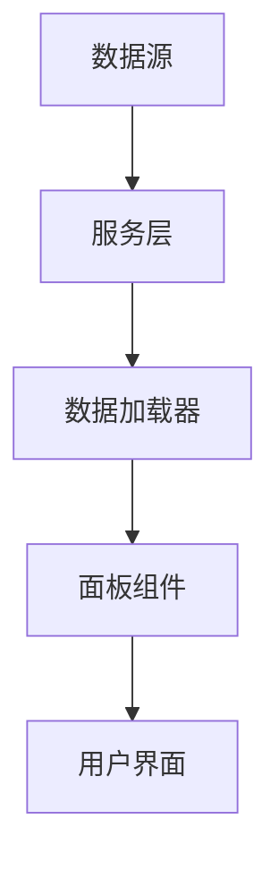

# 自定义战略大屏构建指南

> 基于 WorldMonitor 项目构建你自己的战略大屏

## 目录

1. [项目架构理解](#1-项目架构理解)
2. [快速开始 - 创建你的第一个变体](#2-快速开始---创建你的第一个变体)
3. [面板系统详解](#3-面板系统详解)
4. [数据源配置](#4-数据源配置)
5. [地图图层配置](#5-地图图层配置)
6. [部署与运行](#6-部署与运行)

---

## 1. 项目架构理解

### 1.1 核心概念

```
┌─────────────────────────────────────────────────────────────┐
│                    战略大屏架构                              │
├─────────────────────────────────────────────────────────────┤
│  变体(Variant) → 面板(Panel) → 数据源(Data Source)           │
│                                                              │
│  • 变体: 定义大屏的整体主题和配置                             │
│  • 面板: 展示特定类型信息的可复用组件                         │
│  • 数据源: 提供实时或静态数据的来源                           │
└─────────────────────────────────────────────────────────────┘
```

### 1.2 关键文件位置

```
src/
├── config/
│   ├── panels.ts              # 所有面板配置的定义
│   ├── variants/              # 各变体配置
│   │   ├── full.ts           # 地缘政治完整版
│   │   ├── tech.ts           # 科技版
│   │   ├── finance.ts        # 金融版
│   │   └── ...
│   └── feeds.ts              # RSS/新闻源配置
├── components/               # 面板组件
│   ├── Panel.ts              # 基础面板类
│   ├── NewsPanel.ts          # 新闻面板
│   ├── MarketPanel.ts        # 市场数据面板
│   └── ...
├── services/                 # 数据服务层
│   ├── index.ts              # 服务导出
│   └── ...
├── types/
│   └── index.ts              # TypeScript 类型定义
└── app/
    └── data-loader.ts        # 数据加载管理器
```

### 1.3 数据流向



---

## 2. 快速开始 - 创建你的第一个变体

### 2.1 定义变体配置

创建新文件 `src/config/variants/my-dashboard.ts`:

```typescript
// 我的自定义战略大屏 - 供应链监控主题
import type { PanelConfig, MapLayers } from '@/types';
import type { VariantConfig } from './base';

// 导出基础配置
export * from './base';

// 面板配置 - 只启用你需要的面板
export const DEFAULT_PANELS: Record<string, PanelConfig> = {
  map: { name: '供应链地图', enabled: true, priority: 1 },
  'live-news': { name: '供应链新闻', enabled: true, priority: 1 },
  
  // 添加自定义面板
  'my-custom-metrics': { name: '关键指标', enabled: true, priority: 1 },
  'supplier-status': { name: '供应商状态', enabled: true, priority: 1 },
  'logistics-tracking': { name: '物流追踪', enabled: true, priority: 2 },
  'risk-alerts': { name: '风险预警', enabled: true, priority: 1 },
  
  // 禁用不需要的面板
  // politics: { name: 'World News', enabled: false, priority: 1 },
  // us: { name: 'United States', enabled: false, priority: 1 },
};

// 地图图层配置
export const DEFAULT_MAP_LAYERS: MapLayers = {
  // 基础图层
  conflicts: false,      // 禁用冲突区域
  bases: false,          // 禁用军事基地
  cables: true,          // 启用海底光缆
  pipelines: true,       // 启用管道
  hotspots: true,        // 启用热点区域
  
  // 物流相关
  ais: true,             // 启用船舶追踪
  ports: true,           // 启用港口
  airports: true,        // 启用机场
  
  // 禁用其他图层
  nuclear: false,
  sanctions: false,
  weather: true,         // 启用天气（影响物流）
  outages: true,         // 启用网络中断
  
  // ... 其他图层配置
};

export const VARIANT_CONFIG: VariantConfig = {
  name: 'my-dashboard',
  description: '我的供应链监控大屏',
  panels: DEFAULT_PANELS,
  mapLayers: DEFAULT_MAP_LAYERS,
};
```

### 2.2 注册变体

修改 `src/config/variant.ts`:

```typescript
// 在文件顶部添加类型声明
type VariantType = 'full' | 'tech' | 'finance' | 'commodity' | 'happy' | 'my-dashboard';

// 设置当前变体
export const SITE_VARIANT: VariantType = 
  (import.meta.env.VITE_VARIANT as VariantType) || 'my-dashboard';
```

### 2.3 配置环境变量

创建 `.env` 文件:

```bash
# 变体选择
VITE_VARIANT=my-dashboard

# API 配置（按需添加）
VITE_API_BASE_URL=/api
```

---

## 3. 面板系统详解

### 3.1 创建自定义面板

#### 方法一：继承基础 Panel 类

创建 `src/components/MyCustomPanel.ts`:

```typescript
import { Panel } from './Panel';
import type { PanelOptions } from './Panel';
import { escapeHtml } from '@/utils/sanitize';

export interface MetricData {
  label: string;
  value: string | number;
  change?: number;
  trend?: 'up' | 'down' | 'stable';
}

export class MyCustomPanel extends Panel {
  private metrics: MetricData[] = [];

  constructor() {
    super({
      id: 'my-custom-metrics',
      title: '关键指标监控',
      showCount: true,
      infoTooltip: '实时显示供应链关键指标',
    });
  }

  // 设置数据并渲染
  public setMetrics(data: MetricData[]): void {
    this.metrics = data;
    this.render();
  }

  // 更新单个指标
  public updateMetric(index: number, data: Partial<MetricData>): void {
    if (this.metrics[index]) {
      this.metrics[index] = { ...this.metrics[index], ...data };
      this.render();
    }
  }

  private render(): void {
    if (this.metrics.length === 0) {
      this.showLoading('加载指标数据...');
      return;
    }

    const html = this.metrics.map((metric, i) => {
      const trendClass = metric.trend === 'up' ? 'trend-up' : 
                        metric.trend === 'down' ? 'trend-down' : 'trend-stable';
      const trendIcon = metric.trend === 'up' ? '↑' : 
                       metric.trend === 'down' ? '↓' : '→';
      
      return `
        <div class="metric-item ${trendClass}" data-index="${i}">
          <div class="metric-label">${escapeHtml(metric.label)}</div>
          <div class="metric-value">${escapeHtml(String(metric.value))}</div>
          ${metric.change !== undefined ? `
            <div class="metric-change">
              ${trendIcon} ${metric.change}%
            </div>
          ` : ''}
        </div>
      `;
    }).join('');

    this.setContent(`<div class="metrics-grid">${html}</div>`);
    this.setCount(this.metrics.length);
  }

  // 处理面板内交互
  protected setupInteractions(): void {
    this.content.addEventListener('click', (e) => {
      const item = (e.target as HTMLElement).closest('.metric-item');
      if (item) {
        const index = parseInt(item.getAttribute('data-index') || '0', 10);
        this.onMetricClick(index);
      }
    });
  }

  private onMetricClick(index: number): void {
    // 触发自定义事件
    this.element.dispatchEvent(new CustomEvent('metric-click', {
      detail: { index, metric: this.metrics[index] },
      bubbles: true,
    }));
  }
}
```

#### 方法二：使用函数式组件（轻量级）

```typescript
// src/components/SimpleStatusPanel.ts
import { Panel } from './Panel';

export class SupplierStatusPanel extends Panel {
  constructor() {
    super({
      id: 'supplier-status',
      title: '供应商状态',
      showCount: true,
    });
  }

  public renderStatus(suppliers: Array<{
    name: string;
    status: 'active' | 'warning' | 'critical';
    lastUpdate: Date;
  }>): void {
    const statusColors = {
      active: '#44ff88',
      warning: '#ffaa00',
      critical: '#ff4444',
    };

    const html = suppliers.map(s => `
      <div class="supplier-item" style="border-left-color: ${statusColors[s.status]}">
        <span class="supplier-name">${s.name}</span>
        <span class="supplier-status" style="color: ${statusColors[s.status]}">
          ${s.status.toUpperCase()}
        </span>
        <span class="supplier-time">${this.formatTime(s.lastUpdate)}</span>
      </div>
    `).join('');

    this.setContent(html);
    this.setCount(suppliers.length);
  }

  private formatTime(date: Date): string {
    return new Intl.DateTimeFormat('zh-CN', {
      hour: '2-digit',
      minute: '2-digit',
    }).format(date);
  }
}
```

### 3.2 注册面板到应用

修改 `src/app/data-loader.ts`:

```typescript
// 在 imports 中添加
import { MyCustomPanel, SupplierStatusPanel } from '@/components';

// 在 DataLoaderManager 类中添加数据加载逻辑
export class DataLoaderManager implements AppModule {
  
  async loadAllData(forceAll = false): Promise<void> {
    // ... 现有代码 ...

    // 添加自定义面板数据加载
    if (shouldLoad('my-custom-metrics')) {
      tasks.push({
        name: 'customMetrics',
        task: runGuarded('customMetrics', () => this.loadCustomMetrics())
      });
    }

    if (shouldLoad('supplier-status')) {
      tasks.push({
        name: 'supplierStatus', 
        task: runGuarded('supplierStatus', () => this.loadSupplierStatus())
      });
    }

    // ... 执行所有任务 ...
  }

  private async loadCustomMetrics(): Promise<void> {
    try {
      // 从你自己的 API 获取数据
      const response = await fetch('/api/my-metrics');
      const data = await response.json();
      
      (this.ctx.panels['my-custom-metrics'] as MyCustomPanel)?.setMetrics(data);
    } catch (error) {
      console.error('Failed to load custom metrics:', error);
      (this.ctx.panels['my-custom-metrics'] as MyCustomPanel)?.showError('数据加载失败');
    }
  }

  private async loadSupplierStatus(): Promise<void> {
    // 实现供应商状态加载逻辑
  }
}
```

### 3.3 在 panel-layout.ts 中注册面板

```typescript
// src/app/panel-layout.ts

// 导入自定义面板
import { MyCustomPanel, SupplierStatusPanel } from '@/components';

// 在 createPanel 函数中添加 case
private createPanel(key: string): Panel | null {
  switch (key) {
    // ... 现有 case ...
    
    case 'my-custom-metrics':
      return new MyCustomPanel();
      
    case 'supplier-status':
      return new SupplierStatusPanel();
      
    // ...
  }
}
```

---

## 4. 数据源配置

### 4.1 配置 RSS/新闻源

修改 `src/config/feeds.ts`:

```typescript
// 在文件末尾添加你的数据源

const MY_DASHBOARD_FEEDS: Record<string, Feed[]> = {
  'supply-chain-news': [
    { name: 'Supply Chain Digest', url: rss('https://example.com/supply-chain/rss') },
    { name: 'Logistics News', url: rss('https://example.com/logistics/rss') },
  ],
  'industry-news': [
    { name: 'Industry Updates', url: rss('https://your-industry.com/news/rss') },
  ],
};

// 在 variant-aware exports 中添加
export const FEEDS = SITE_VARIANT === 'my-dashboard'
  ? MY_DASHBOARD_FEEDS
  : SITE_VARIANT === 'tech'
    ? TECH_FEEDS
    : // ... 其他变体
```

### 4.2 创建自定义数据服务

创建 `src/services/my-custom-service.ts`:

```typescript
import { toApiUrl } from './runtime';

export interface Supplier {
  id: string;
  name: string;
  country: string;
  status: 'active' | 'warning' | 'critical';
  riskScore: number;
  lastDelivery: Date;
}

export async function fetchSuppliers(): Promise<Supplier[]> {
  const response = await fetch(toApiUrl('/api/suppliers'));
  if (!response.ok) throw new Error('Failed to fetch suppliers');
  return response.json();
}

export async function fetchSupplyChainMetrics(): Promise<{
  onTimeDelivery: number;
  inventoryTurnover: number;
  supplierRisk: number;
}> {
  const response = await fetch(toApiUrl('/api/supply-chain/metrics'));
  if (!response.ok) throw new Error('Failed to fetch metrics');
  return response.json();
}

// 添加实时数据流支持
export function subscribeToSupplyChainUpdates(
  callback: (update: { type: string; data: unknown }) => void
): () => void {
  const ws = new WebSocket('wss://your-websocket-endpoint');
  
  ws.onmessage = (event) => {
    const update = JSON.parse(event.data);
    callback(update);
  };

  return () => ws.close();
}
```

### 4.3 在 services/index.ts 导出

```typescript
// src/services/index.ts

export {
  fetchSuppliers,
  fetchSupplyChainMetrics,
  subscribeToSupplyChainUpdates,
} from './my-custom-service';
```

---

## 5. 地图图层配置

### 5.1 添加自定义地图图层

修改 `src/types/index.ts`:

```typescript
export interface MapLayers {
  // ... 现有图层 ...
  
  // 添加自定义图层
  supplierLocations: boolean;
  warehouseHeatmap: boolean;
  deliveryRoutes: boolean;
}
```

### 5.2 在地图组件中添加图层渲染

修改 `src/components/Map.ts`:

```typescript
// 添加自定义图层数据类型
interface SupplierLocation {
  id: string;
  name: string;
  lat: number;
  lon: number;
  status: 'active' | 'warning' | 'critical';
  type: 'supplier' | 'warehouse' | 'hub';
}

// 在 Map 类中添加方法
public setSupplierLocations(locations: SupplierLocation[]): void {
  if (!this.map) return;
  
  // 清除现有图层
  if (this.supplierLayer) {
    this.map.removeLayer(this.supplierLayer);
  }
  
  // 创建新图层
  this.supplierLayer = new deck.ScatterplotLayer({
    id: 'supplier-locations',
    data: locations,
    getPosition: d => [d.lon, d.lat],
    getFillColor: d => {
      switch (d.status) {
        case 'active': return [68, 255, 136];
        case 'warning': return [255, 170, 0];
        case 'critical': return [255, 68, 68];
      }
    },
    getRadius: d => d.type === 'hub' ? 10000 : 5000,
    pickable: true,
    onClick: info => {
      if (info.object) {
        this.showSupplierPopup(info.object);
      }
    },
  });
  
  this.updateLayers();
}
```

---

## 6. 部署与运行

### 6.1 本地开发

```bash
# 安装依赖
npm install

# 以你的变体启动开发服务器
VITE_VARIANT=my-dashboard npm run dev

# 或者修改 .env 后运行
npm run dev
```

### 6.2 构建生产版本

```bash
# 构建
VITE_VARIANT=my-dashboard npm run build

# 预览
npm run preview
```

### 6.3 部署到 Vercel

创建 `vercel.json`:

```json
{
  "buildCommand": "npm run build",
  "framework": "vite",
  "env": {
    "VITE_VARIANT": "my-dashboard"
  }
}
```

---

## 附录

### A. 面板配置参考

| 属性 | 类型 | 说明 |
|------|------|------|
| `name` | string | 面板显示名称 |
| `enabled` | boolean | 是否默认启用 |
| `priority` | number | 优先级(1=高, 2=低) |
| `premium` | 'locked' \| 'enhanced' | 付费功能标记 |

### B. 推荐的面板开发模式

```typescript
// 最佳实践示例
export class BestPracticePanel extends Panel {
  private data: YourDataType[] = [];
  private refreshInterval?: number;

  constructor() {
    super({
      id: 'your-panel-id',
      title: '面板标题',
      showCount: true,
      infoTooltip: '面板说明文本',
    });
  }

  // 1. 数据加载方法
  public async loadData(): Promise<void> {
    this.showLoading();
    try {
      const data = await fetchYourData();
      this.setData(data);
    } catch (error) {
      this.showError('加载失败', () => this.loadData());
    }
  }

  // 2. 数据设置方法
  public setData(data: YourDataType[]): void {
    this.data = data;
    this.render();
    this.setCount(data.length);
  }

  // 3. 渲染方法
  private render(): void {
    // 实现渲染逻辑
  }

  // 4. 清理方法
  public destroy(): void {
    if (this.refreshInterval) {
      clearInterval(this.refreshInterval);
    }
    super.destroy();
  }
}
```

### C. 常见需求解决方案

#### 如何只保留地图和几个关键面板？

1. 在 `DEFAULT_PANELS` 中只启用需要的面板
2. 在 `DEFAULT_MAP_LAYERS` 中启用需要的图层
3. 移除 `data-loader.ts` 中不需要的数据加载任务

#### 如何接入自己的 API？

1. 在 `src/services/` 创建服务文件
2. 在 `data-loader.ts` 中添加调用逻辑
3. 在面板组件中调用服务方法

#### 如何修改样式？

1. 面板样式：在 `src/styles/panels.css` 添加 CSS
2. 主题变量：修改 CSS 变量定义
3. 单个面板：在组件内联样式或使用 scoped CSS

---

**下一步建议：**

1. 从复制 `src/config/variants/full.ts` 开始，逐步移除不需要的面板
2. 创建一个简单的自定义面板练习数据流
3. 配置你自己的 RSS 源或 API 端点
4. 根据需要添加地图图层

如需更详细的某个部分说明，请告诉我！
